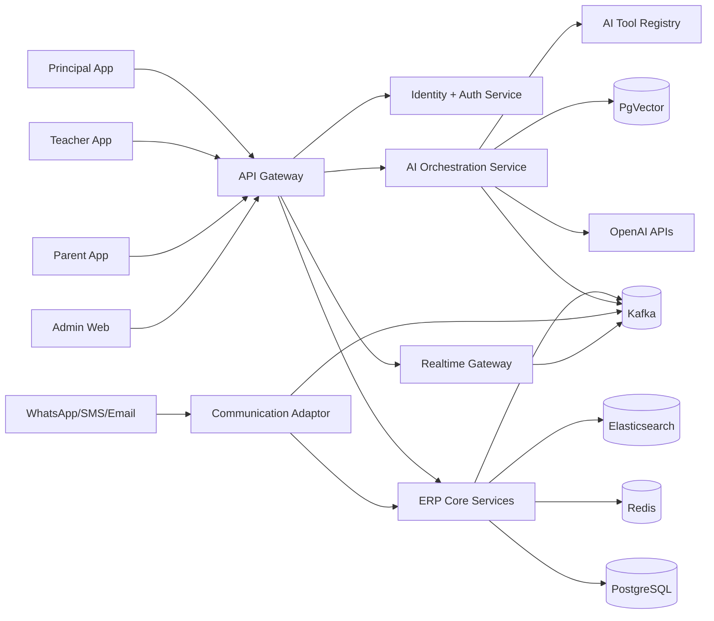
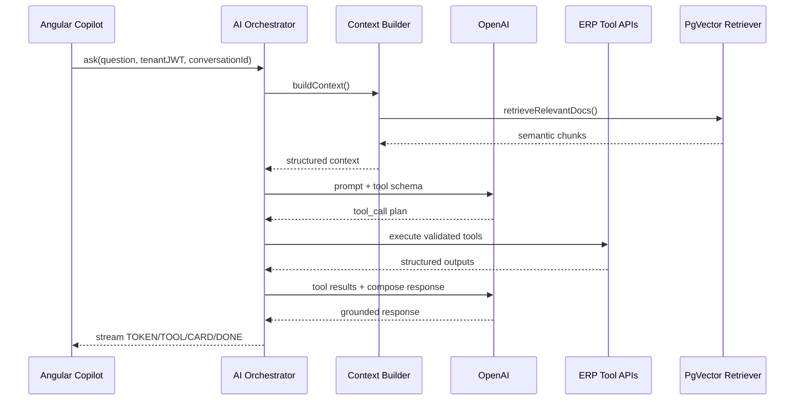
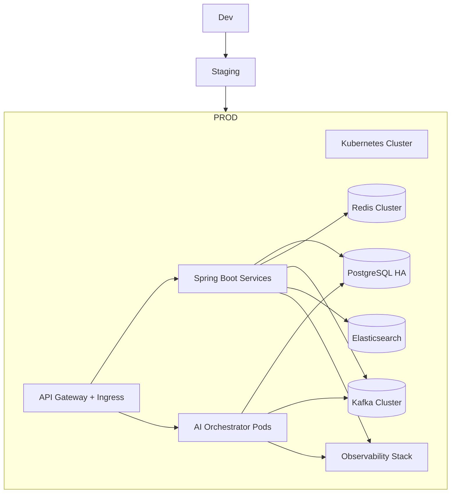

# SchoolOS Enterprise Blueprint (India)

## 1) Vision and Product Positioning

SchoolOS is an AI-native, multi-tenant School ERP platform designed as a "School Operating System" for K12 institutions in India.  
The platform targets operational automation, predictive decision support, and conversational ERP operations across principal, teacher, parent, finance, and admin personas.

Design goals:
- AI-first workflows, not chatbot add-ons.
- Enterprise tenancy and security-by-design.
- Modular domain boundaries with microservice-ready evolution.
- Event-driven extensibility for analytics, automations, and integrations.
- Mobile-first premium UX for non-technical school operators.

## 2) System Context and High-Level Architecture



Deployment style:
- Stateless Java 21 Spring Boot services, containerized and Kubernetes-ready.
- API Gateway in front of backend services.
- Dedicated AI orchestration microservice.
- Shared platform services (Auth, Notification, Audit, Billing, Config).

## 3) Microservice and Bounded Context Map

### 3.1 Core Platform Services
- `gateway-service`: routing, authn pre-checks, rate-limits, request signing checks.
- `identity-service`: JWT, OAuth2, SSO adapters, session and token policy.
- `tenant-service`: tenant provisioning, feature flags, subscription plans, lifecycle.
- `config-service`: tenant and school settings, policy snapshots, themes.
- `audit-service`: immutable audit events, compliance exports.
- `notification-service`: in-app, push, email, SMS, WhatsApp via provider abstraction.
- `ai-orchestrator-service`: LLM orchestration, tool-calling, context engine, RAG.

### 3.2 ERP Domain Services
- `academics-service`: classes, sections, timetable, attendance, exams, grading, report cards.
- `finance-service`: fee plans, invoices, dues, reminders, payment reconciliation.
- `hr-service`: staff records, payroll, leave, workload metrics.
- `admissions-service`: inquiry CRM, lead scoring, funnel and campaign attribution.
- `engagement-service`: circulars, chat, PTM summaries, parent communication history.
- `transport-service`: route planning, bus attendance, GPS integrations.
- `library-service`: catalog, issue/return, inventory and penalties.
- `hostel-service`: occupancy, hostel attendance, fee linkage.
- `analytics-service`: KPI aggregates, risk features, dashboards.

### 3.3 Integration and Async Services
- `workflow-service`: long-running orchestration and human approvals.
- `integration-hub-service`: ERP adapters, accounting, LMS, payment gateways, government exports.
- `search-service`: Elasticsearch indexing and query APIs.

## 4) Clean + Hexagonal + DDD Package Structure

Per-service package convention:

```text
com.schoolos.<service>
  ├─ bootstrap/                     # SpringBoot app and wiring
  ├─ domain/
  │   ├─ model/                     # Aggregates, entities, VOs
  │   ├─ event/                     # Domain events
  │   ├─ policy/                    # Domain invariants
  │   └─ service/                   # Pure domain services
  ├─ application/
  │   ├─ command/                   # CQRS commands and handlers
  │   ├─ query/                     # Query handlers and read DTOs
  │   ├─ port/
  │   │   ├─ in/                    # Use-case interfaces
  │   │   └─ out/                   # Persistence, messaging, external ports
  │   └─ mapper/
  ├─ adapter/
  │   ├─ in/
  │   │   ├─ web/                   # REST, WebSocket controllers
  │   │   ├─ kafka/                 # Event consumers
  │   │   └─ scheduler/
  │   └─ out/
  │       ├─ persistence/           # JPA repositories, SQL mappers
  │       ├─ cache/                 # Redis
  │       ├─ messaging/             # Kafka producers
  │       ├─ search/                # Elasticsearch
  │       └─ external/              # payment, whatsapp, SMS providers
  ├─ security/                      # authz policies, ABAC evaluators
  ├─ observability/                 # tracing, meters, log enricher
  └─ shared/                        # cross-cutting primitives local to service
```

## 5) Multi-Tenancy Strategy

Tenancy model:
- Shared database with strict row-level tenant isolation (`tenant_id`) and optional schema isolation for premium tenants.
- Every write/read path enforces tenant context from signed JWT + server-side tenant resolution.
- Tenant-aware caches (`tenantId:key`) and tenant-scoped index aliases in Elasticsearch.

Controls:
- Tenant in JWT (`tid`, `schoolId`, `roles`, `featureFlags`).
- Hibernate filters + Spring Data specifications with hard mandatory tenant predicates.
- Tenant policy guardrails at service and AI tool layers.
- Per-tenant throttles and quotas.

Tenant lifecycle:
1. Onboard request accepted.
2. Tenant profile + subscription created.
3. Default config + roles + templates seeded.
4. Async provisioning emits `tenant.provisioned.v1`.
5. Welcome and training workflows triggered.

## 6) Security and Compliance Architecture

Identity and access:
- OAuth2 + JWT for user sessions.
- RBAC for coarse access + ABAC for contextual checks (role, class ownership, student relation, time window).
- Fine-grained permissions for AI tool execution.

Data security:
- TLS everywhere, at-rest encryption for DB snapshots and object storage.
- Secrets from secret manager, no static credentials in repos.
- PII masking in logs and AI traces.
- Request signing for privileged machine-to-machine APIs.

AI security:
- Prompt injection detection and sanitization stage.
- Tool allow-list per role + tenant + action type.
- Output policy checks for data leakage before response release.
- Human-in-the-loop approvals for destructive actions.

Audit:
- Tamper-evident append-only audit records.
- Correlation ID + tenant ID in all logs/events/spans.
- Retention and export policies aligned with school compliance.

## 7) AI Orchestration Service (Most Critical Layer)

### 7.1 Internal Components
- `AgentRouter`: routes requests to Principal/Teacher/Parent/Finance/etc agent profiles.
- `ContextBuilder`: builds structured context block (tenant, role, session, settings, memory, summaries).
- `PromptOrchestrator`: system prompt + policy prompt + task prompt + tool instructions.
- `ToolPlanner`: determines tool calls from model function-call output.
- `ToolRegistry`: dynamic registry of secure backend capabilities as typed tools.
- `ToolExecutor`: validates authz, arguments, rate limits, idempotency.
- `RagRetriever`: semantic retrieval from PgVector.
- `MemoryService`: short-term conversation memory + long-term summaries.
- `ResponseComposer`: grounded natural-language generation and citation assembly.
- `StreamPublisher`: token + event streaming over SSE/WebSocket.

### 7.2 AI Request Pipeline



### 7.3 Tool Registry Contract

Tool descriptor (stored in config DB and loaded at runtime):
- `toolName`
- `description`
- `inputSchema` (JSON Schema)
- `requiredPermissions`
- `riskLevel` (`READ`, `WRITE_APPROVAL`, `CRITICAL_APPROVAL`)
- `timeoutMs`
- `idempotencyKeyRequired`
- `rateLimitProfile`
- `ownerService`
- `version`

Execution rules:
- No direct SQL by model.
- Only typed tool invocations.
- Every tool call logged with result metadata.
- Failed tool calls surfaced to model with bounded error envelope.

### 7.4 Example Tools
- `getLowAttendanceStudents`
- `getFeeDefaulters`
- `generateReportCardSummary`
- `getTeacherWorkload`
- `getAdmissionLeads`
- `getStudentRiskPrediction`
- `sendFeeReminder` (approval required)
- `createCircular` (approval required)
- `summarizePTMData`
- `generateHomework`
- `generateQuestionPaper`

## 8) RAG Architecture (PgVector)

Knowledge classes:
- School policies and circulars.
- ERP help manuals and SOPs.
- Compliance documents and board rules.
- Fee structures, transport rules, handbook documents.

RAG pipeline:
1. Ingestion from document APIs/storage.
2. Chunking with metadata (tenant, module, docType, class, language, sensitivity).
3. Embeddings generation via OpenAI embedding model.
4. Storage in PostgreSQL + PgVector.
5. Hybrid retrieval (semantic + metadata filters + keyword fallback).
6. Context packing with token budget policies.

Guardrails:
- Tenant and sensitivity filters always applied in retrieval query.
- Source citation IDs included in response context for traceability.

## 9) Data Platform and Database Design

### 9.1 Core Schema Conventions
- All business tables include: `id`, `tenant_id`, `created_at`, `updated_at`, `deleted_at`, `version`.
- Soft deletes for business entities; hard deletes only in retention jobs.
- Audit shadow tables for critical domains.
- Optimistic locking on write-heavy aggregates.

### 9.2 Representative Tables
- `tenants`, `tenant_subscriptions`, `tenant_features`, `tenant_themes`.
- `users`, `roles`, `permissions`, `user_role_map`, `policy_rules`.
- `students`, `guardians`, `enrollments`, `attendance_daily`, `exam_results`.
- `fee_heads`, `fee_invoices`, `fee_payments`, `fee_dues`, `scholarships`.
- `teacher_profiles`, `payroll_runs`, `leave_requests`, `workload_snapshots`.
- `admission_leads`, `inquiry_events`, `funnel_stage_history`.
- `notifications`, `communication_messages`, `delivery_attempts`.
- `ai_conversations`, `ai_messages`, `ai_tool_logs`, `ai_memory_summaries`, `ai_usage_metrics`.
- `vector_documents` (pgvector embedding store + metadata jsonb).

### 9.3 Partitioning and Indexing
- Partition large time-series tables monthly (`attendance_daily`, `notifications`, `ai_tool_logs`).
- Composite indexes: `(tenant_id, <module_fk>, created_at desc)`.
- Partial indexes for active records (`deleted_at is null`).
- GIN index for metadata jsonb where required.
- IVF/Flat vector indexes tuned by tenant data size profile.

### 9.4 Data Lifecycle
- Hot: last 12 months in primary tables.
- Warm: 12-36 months archive schema.
- Cold: object storage exports for legal retention.
- Scheduled archival and restore playbooks.

## 10) Event-Driven Model (Kafka)

Topic naming:
- `schoolos.<domain>.<event>.v1`

Key topics:
- `schoolos.tenant.provisioned.v1`
- `schoolos.attendance.marked.v1`
- `schoolos.fees.invoice_generated.v1`
- `schoolos.fees.payment_received.v1`
- `schoolos.communication.message_requested.v1`
- `schoolos.ai.tool_invoked.v1`
- `schoolos.ai.response_generated.v1`
- `schoolos.analytics.feature_computed.v1`
- `schoolos.audit.security_event.v1`

Patterns:
- Transactional outbox per service.
- At-least-once delivery with idempotent consumers.
- Dead letter topics + replay tooling.

## 11) API Contract Blueprint

Base paths:
- `/api/v1/auth/*`
- `/api/v1/tenants/*`
- `/api/v1/academics/*`
- `/api/v1/finance/*`
- `/api/v1/hr/*`
- `/api/v1/admissions/*`
- `/api/v1/engagement/*`
- `/api/v1/ai/*`

Representative APIs:
- `POST /api/v1/ai/chat/stream`: starts AI conversational stream.
- `POST /api/v1/ai/tools/{toolName}/execute`: secure internal tool execution endpoint.
- `GET /api/v1/analytics/principal-dashboard`: KPI and risk cards.
- `POST /api/v1/finance/dues/reminders:dispatch`: reminder workflow trigger.
- `POST /api/v1/admissions/leads/{id}/score`: lead scoring execution.

API standards:
- OpenAPI 3 docs for all services.
- Cursor pagination (`cursor`, `limit`) for high-volume lists.
- Idempotency keys for command APIs.
- RFC7807 error envelopes.

## 12) Frontend Architecture (Angular Latest)

Structure:
- Standalone components with feature-first modules.
- Angular Signals for local reactive UI state.
- RxJS streams for async workflows and server events.
- Tailwind + Angular Material design system.

Feature layout:

```text
frontend/src/app
  ├─ core/                 # auth, interceptors, guards, tenant context, api client
  ├─ shared/               # ui kit, pipes, directives, utility signals
  ├─ features/
  │   ├─ dashboard/
  │   ├─ academics/
  │   ├─ finance/
  │   ├─ hr/
  │   ├─ admissions/
  │   ├─ communication/
  │   ├─ analytics/
  │   └─ ai-copilot/
  ├─ shell/                # app frame, nav, profile, theme switch
  └─ app.routes.ts
```

AI Copilot UX:
- Docked sidebar + full-screen workspace.
- Streaming response renderer and tool activity timeline.
- Confirmation prompts for write actions.
- Saved prompts and role-specific quick actions.
- Explainability cards with source and confidence hints.

## 13) Communication Platform (WhatsApp-First)

Provider abstraction interface:
- `sendMessage(channel, templateId, payload, tenantContext)`
- channel adapters: WhatsApp Business API, SMS gateway, Email SMTP/API, Push provider.

Reliability:
- Durable queue with retries and exponential backoff.
- Provider failover policy.
- Delivery status callbacks normalized to common event model.

## 14) Caching and Performance Strategy

Redis:
- Session and token introspection caches.
- Tenant config cache and feature flag snapshots.
- Read-heavy aggregates (dashboard cards).
- AI response fragment caching for safe deterministic prompts.

HTTP and edge:
- CDN for static frontend assets.
- ETag and cache-control for read endpoints.
- Compression and Brotli in gateway.

DB optimization:
- Query budget per endpoint.
- Pagination enforced by API contract.
- Query observability and slow query alerting.

## 15) Observability and SRE

Telemetry stack:
- OpenTelemetry for traces and metrics.
- Structured JSON logs with trace and tenant correlation.
- Prometheus + Grafana dashboards.
- Alertmanager with tenant-aware SLO burn alerts.

Critical dashboards:
- API p95 latency by service and tenant tier.
- AI request latency (model + tools + total).
- Tool failure rate and approval denial rates.
- Notification delivery success by provider.
- Kafka lag and consumer health.

## 16) Deployment and Environment Architecture



Kubernetes baseline:
- HPA for stateless services.
- PodDisruptionBudgets and anti-affinity.
- Secrets via external secret manager integration.
- Separate node pools for AI-heavy workloads.

## 17) CI/CD and Quality Gates

GitHub Actions pipeline:
1. Lint + unit tests.
2. Contract tests (OpenAPI + consumer contracts).
3. Security scans (SAST, dependency, container).
4. Build artifacts and Docker images.
5. Deploy to staging with smoke tests.
6. Manual/automated promotion to production with canary rollout.

Release gates:
- Error budget health.
- Migration compatibility checks.
- Backward compatible API checks.
- AI safety regression suite.

## 18) Coding Standards and Reusable Abstractions

Backend standards:
- SOLID + constructor injection.
- No business logic in controllers.
- Ports/adapters mandatory for external systems.
- Domain events emitted from aggregates.
- Global exception taxonomy and error mapping.

AI standards:
- Prompt templates versioned and tested.
- Tool schemas backward-compatible and versioned.
- Safety policy checks before externalized responses.

Frontend standards:
- Feature isolation with shared design tokens.
- Signal-first state for local component complexity.
- Route-level lazy loading and guard policy checks.

## 19) Phased Implementation Roadmap

Phase 0 (4 weeks): Foundation
- Tenant, identity, gateway, observability, CI/CD, baseline domain skeleton.

Phase 1 (6 weeks): Core ERP
- Academics, finance core, communication bus, dashboards, mobile-ready shell.

Phase 2 (6 weeks): AI Foundation
- AI orchestrator, tool registry, streaming UI, memory, role-based AI agents.

Phase 3 (8 weeks): Predictive and RAG
- PgVector retrieval, risk models, principal analytics assistant, policy knowledge base.

Phase 4 (6 weeks): Advanced Workflows
- Approval workflows, automation agents, WhatsApp-first campaigns, enterprise billing.

Phase 5 (ongoing): Scale and Expansion
- Multi-region readiness, partner ecosystem, third-party integrations, AI multi-agent collaboration.

## 20) Immediate Build Plan for This Repository

Short-term execution sequence aligned to existing codebase:
1. Split backend into bounded contexts under consistent hexagonal package strategy.
2. Formalize AI tool metadata registry table and runtime loader.
3. Add tenant-scoped ABAC guard library reusable across all modules.
4. Introduce vector document pipeline (`PgVector`) and retriever interface.
5. Add event outbox framework and standard topic contracts.
6. Implement API gateway policies (rate limits, request signing for internal APIs).
7. Upgrade Angular AI workspace with role-specific agent cards and action approvals.
8. Add SLO dashboards and AI trace panels.

## 21) Non-Functional Targets (Production SLO Baseline)

- API availability: 99.95% monthly.
- Chat streaming first-token latency: <= 1.2s p95.
- Standard API p95 latency: <= 350ms.
- Tool call success ratio: >= 99.0%.
- Notification delivery acknowledgement: <= 10s p95.
- Tenant isolation incidents: 0 tolerance.

---

This blueprint is intentionally implementation-oriented and compatible with the existing Spring + Angular foundation in this repository, while defining clear extension seams for full enterprise SchoolOS evolution.
